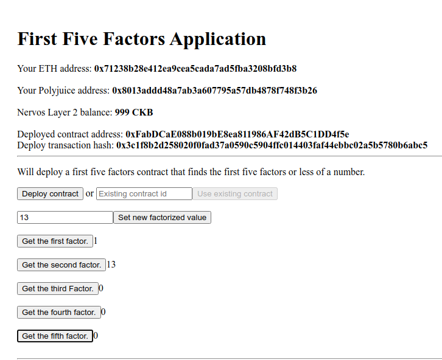
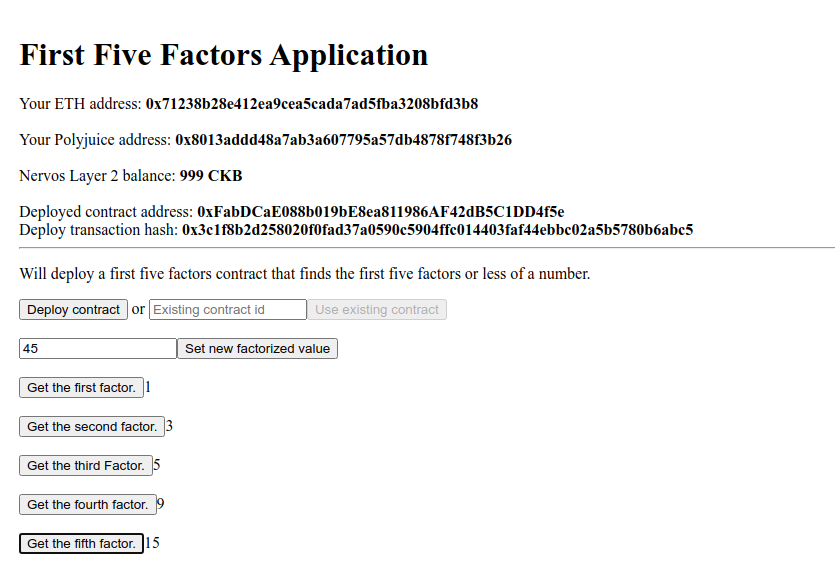

# Task 07 - Port an Existing Ethereum dApp to Polyjuice

1) Screenshots of the Application on Godwoken:




2) Link to Github Respository:
https://github.com/MajesticLotus/Godwoken-App

3) Smart Contract Address:
```
0xFabDCaE088b019bE8ea811986AF42dB5C1DD4f5e
```

4) Transaction Hash of the Smart Contract:
```
0x3c1f8b2d258020f0fad37a0590c5904ffc014403faf44ebbc02a5b5780b6abc5
```

5) ABI of the smart contract:
```
abi": [
    {
      "inputs": [],
      "stateMutability": "payable",
      "type": "constructor"
    },
    {
      "inputs": [
        {
          "internalType": "uint256",
          "name": "nums",
          "type": "uint256"
        }
      ],
      "name": "factorize",
      "outputs": [],
      "stateMutability": "payable",
      "type": "function"
    },
    {
      "inputs": [],
      "name": "firstFactor",
      "outputs": [
        {
          "internalType": "uint256",
          "name": "",
          "type": "uint256"
        }
      ],
      "stateMutability": "view",
      "type": "function"
    },
    {
      "inputs": [],
      "name": "secondFactor",
      "outputs": [
        {
          "internalType": "uint256",
          "name": "",
          "type": "uint256"
        }
      ],
      "stateMutability": "view",
      "type": "function"
    },
    {
      "inputs": [],
      "name": "thirdFactor",
      "outputs": [
        {
          "internalType": "uint256",
          "name": "",
          "type": "uint256"
        }
      ],
      "stateMutability": "view",
      "type": "function"
    },
    {
      "inputs": [],
      "name": "fourthFactor",
      "outputs": [
        {
          "internalType": "uint256",
          "name": "",
          "type": "uint256"
        }
      ],
      "stateMutability": "view",
      "type": "function"
    },
    {
      "inputs": [],
      "name": "fifthFactor",
      "outputs": [
        {
          "internalType": "uint256",
          "name": "",
          "type": "uint256"
        }
      ],
      "stateMutability": "view",
      "type": "function"
    }
  ]
```
