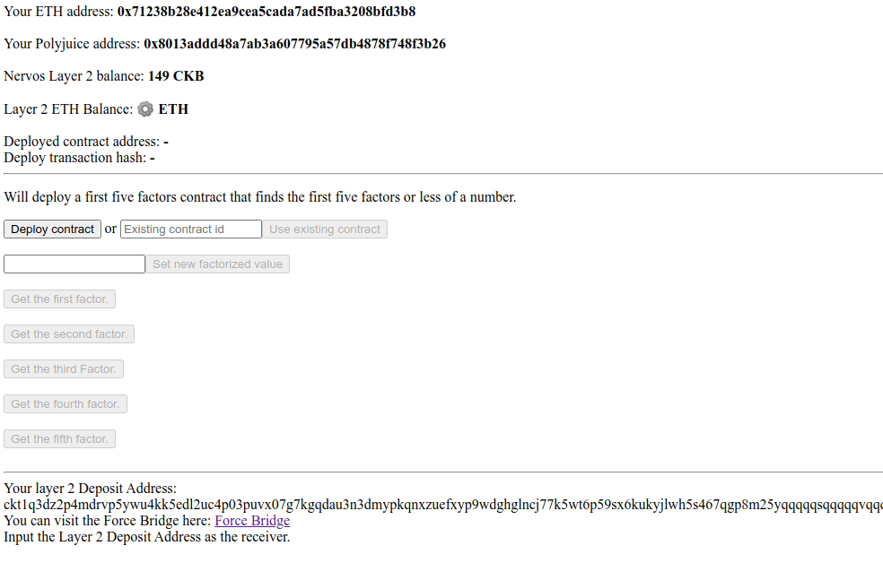
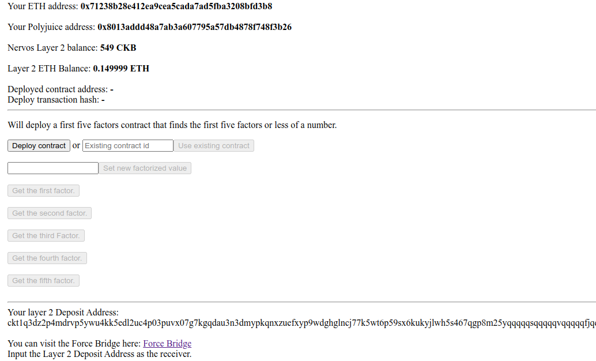

# Task 8 - Modifying Ported Dapp


1) A screenshot or video of your EVM application on Layer 2 with Force Bridge support:




2) The address of the SUDT-ERC20 Proxy Contract that you deployed (in text format):
```
0x8d2c9AE1981B4a72C57cE912882C360A5740C1fE
```
3) A link to the GitHub repository with your EVM application that integrates Force Bridge support:
https://github.com/MajesticLotus/ForceBridgeGodwoken
