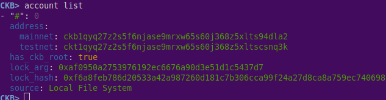

# Task 11 - Using Tron Wallet For Smart Contract Call

1) Screenshot of Accounts:



2) Link to Layer 1 Address:


3) A screenshot of the console output immediately after you have successfully submitted a CKByte deposit to your Tron account on Layer 2:


4) A screenshot of the console output immediately after you have successfully issued a smart contract calls on Layer 2:


5)The transaction hash of the "Contract call" from the console output:
```

```

6) The contract address that you called (in text format):
```

```

7) The ABI for contract you made a call on (in text format):
```

```

8) Tron Address:
```
TAPdYco2dM71j9Zkm1HFKvyAdTpTGp4whc
```
