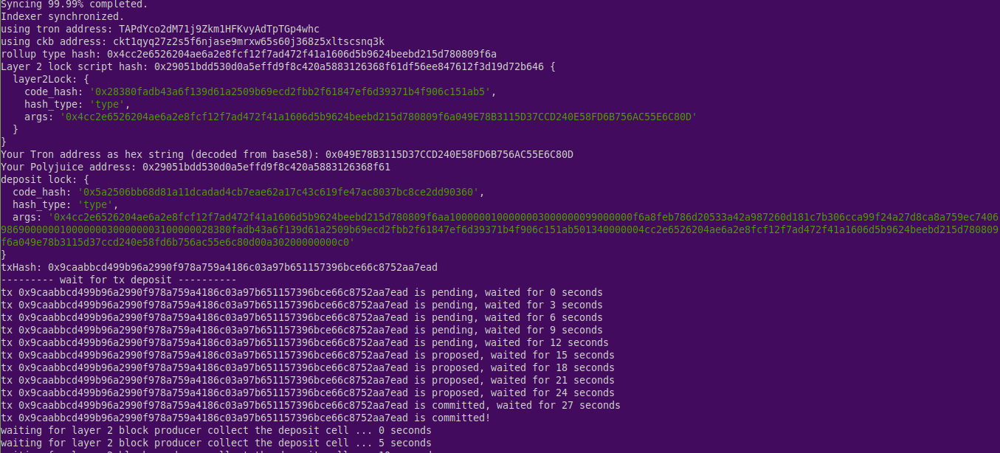
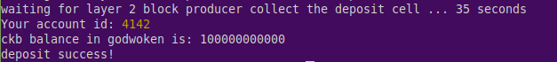
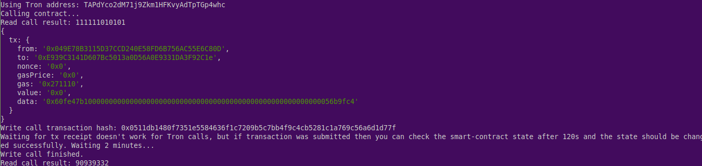

# Task 11 - Using Tron Wallet For Smart Contract Call

1) Screenshot of Accounts:


2) Link to Layer 1 Address:

https://explorer.nervos.org/aggron/address/ckt1qyq27z2s5f6njase9mrxw65s60j368z5xltscsnq3k

3) A screenshot of the console output after submitted a CKByte deposit to your Tron account on Layer 2:




4) A screenshot of the console output immediately after you have successfully issued a smart contract calls on Layer 2:



5) The transaction hash of the "Contract call" from the console output:
```
0x0511db1480f7351e5584636f1c7209b5c7bb4f9c4cb5281c1a769c56a6d1d77f
```

6) The contract address that you called (in text format):
```
0xE939C3141D607Bc5013a0D56A0E9331DA3F92C1e
```

7) The ABI for contract you made a call on (in text format):
```
[
    {
      "inputs": [],
      "stateMutability": "payable",
      "type": "constructor"
    },
    {
      "inputs": [
        {
          "internalType": "uint256",
          "name": "x",
          "type": "uint256"
        }
      ],
      "name": "set",
      "outputs": [],
      "stateMutability": "payable",
      "type": "function"
    },
    {
      "inputs": [],
      "name": "get",
      "outputs": [
        {
          "internalType": "uint256",
          "name": "",
          "type": "uint256"
        }
      ],
      "stateMutability": "view",
      "type": "function"
    }
]
```

8) Tron Address:
```
TAPdYco2dM71j9Zkm1HFKvyAdTpTGp4whc
```
