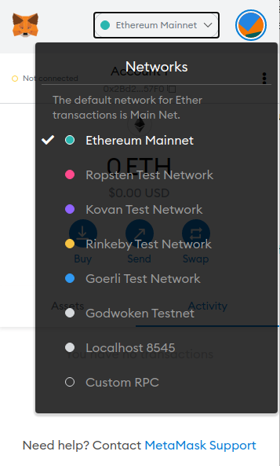

# Task 12 - Document Porting An Existing Ethereum DApp To Polyjuice

Polyjuice is an EVM compatible environment which allows Solidity Smart Contracts to run on Nervos. This allows Ethereum DApps to run on Nervos.

1) Ensure Existing Ethereum DApp is functional

Before moving on to attempting to port over an Ethereum DApp over to Polyjuice, ensure that the DApp is fully functional. So set it up ensure it all works fine before moving on.

2) Installing Dependencies

To start porting over this DApp you have to install the dependencies that are required for a Polyjuice DApp in the first place. So inside of your DApp's folder run these commands:
```
yarn add @polyjuice-provider/web3@0.0.1-rc7 nervos-godwoken-integration@0.0.6
```
3) Replacing the old Web3 and in with the new Web3

You will need to replace your old web3 provider that was used with Ethereum to one that can be used with the Godwoken framework.
You can see how this new web3 provider will look like with my example DApp here: https://github.com/MajesticLotus/Godwoken-App/blob/main/src/config.ts
```
export const CONFIG = {
    WEB3_PROVIDER_URL: 'https://godwoken-testnet-web3-rpc.ckbapp.dev',
    ROLLUP_TYPE_HASH: '0x4cc2e6526204ae6a2e8fcf12f7ad472f41a1606d5b9624beebd215d780809f6a',
    ETH_ACCOUNT_LOCK_CODE_HASH: '0xdeec13a7b8e100579541384ccaf4b5223733e4a5483c3aec95ddc4c1d5ea5b22'
};
```
So you can see how it has a new web3 provider url and it introduces 2 new values the rollup and the lock code hash. These values are utilized by the Godwoken Testnet currently.

4) Creating Polyjuice Web3

We will now move on to creating the Polyjuice web3, so wherever your DApp's main UI file is you can move over to there.
You will want to add these importations into the file:
```
import { PolyjuiceHttpProvider } from '@polyjuice-provider/web3';
import { CONFIG } from '../config';
```
Now locate where the old web3 instance is created it should look similar to this line of code:
```
const web3 = new Web3((window as any).ethereum);
```
You will want to replace that with this block of code which creates all the constants needed for the Polyjuice web3 instance:
```
const godwokenRpcUrl = CONFIG.WEB3_PROVIDER_URL;
const providerConfig = {
    rollupTypeHash: CONFIG.ROLLUP_TYPE_HASH,
    ethAccountLockCodeHash: CONFIG.ETH_ACCOUNT_LOCK_CODE_HASH,
    web3Url: godwokenRpcUrl
};
const provider = new PolyjuiceHttpProvider(godwokenRpcUrl, providerConfig);
const web3 = new Web3(provider);
```

5) Changing Gas Limit

Currently Godwoken requires a high gas limit for transactions so you will need to implement this in your DApp.
You can just create a simple object using the gas property from MetaMask like here:
```
const DEFAULT_SEND_OPTIONS = {
    gas: 6000000
};
```
In my example DApp I implement this in this file: https://github.com/MajesticLotus/Godwoken-App/blob/main/src/lib/contracts/FirstFiveFactorsWrapper.ts
You can view my implementation right at the top.

Now when your passing to the send() method you can add it like here:
```
async factorizeValue(value: number, fromAddress: string) {
        const tx = await this.contract.methods.factorize(value).send({
            ...DEFAULT_SEND_OPTIONS,
            from: fromAddress,
            value
        });
```

6) Displaying Polyjuice Address (Optional)

So now you have stuff up to point, and now we will be looking at how you can display the user's Polyjuice address. Now every Ethereum address can be mapped to a Polyjuice address.
First import the AddressTranslator:
```
import { AddressTranslator } from 'nervos-godwoken-integration';
```
Then you can utilize the following code to determine the Polyjuice Address:
```
const addressTranslator = new AddressTranslator();
const polyjuiceAddress = addressTranslator.ethAddressToGodwokenShortAddress(ethereumAddress);
```
In my showcase DApp I utilized React in order to show my Polyjuice Address so depending on your frontend it will be different for you.
Here is how I did mines you can view the full code here: https://github.com/MajesticLotus/Godwoken-App/blob/main/src/ui/app.tsx
```
const [polyjuiceAddress, setPolyjuiceAddress] = useState<string | undefined>();

useEffect(() => {
        if (accounts?.[0]) {
            const addressTranslator = new AddressTranslator();
            setPolyjuiceAddress(addressTranslator.ethAddressToGodwokenShortAddress(accounts?.[0]));
        } else {
            setPolyjuiceAddress(undefined);
        }
    }, [accounts?.[0]]);

<br />
Your Polyjuice address: <b>{polyjuiceAddress || ' - '}</b>
<br />
```
So go ahead and play around with it.

7) Setup Godwoken in your MetaMask

Your nearly finished now you have to setup your Metamask to work with the Godwoken Testnet. To do this your going to add a custom RPC



You will now input the following details into the form:
```
Network Name: Godwoken Testnet
RPC URL: https://godwoken-testnet-web3-rpc.ckbapp.dev
Chain ID: 71393
Currency Symbol: <Leave Empty>
Block Explorer URL: <Leave Empty>
```
Now your done!

7) Open up your DApp
Your finished, well done. Thats how easy porting an Ethereum DApp over to the Amazing Polyjuice layer really is. So get building on Nervos!
Nervos is hosting a Hackathon with $200k in prizes for building on their network you can find out more here: 
https://www.nervos.org/blog/nervos-hackathon-broaden-the-spectrum/
The prizes are as follows:
```
First prize: 1 first prize of $40,000 in CKB
Second prize: 2 second prizes of $20,000 in CKB
Third prize: 5 third prizes of $10,000 in CKB
Honorable Mention: 10 prizes of $2,000 in CKB
```

You can view my finished DApp here: https://github.com/MajesticLotus/Godwoken-App
Thanks for reading!
